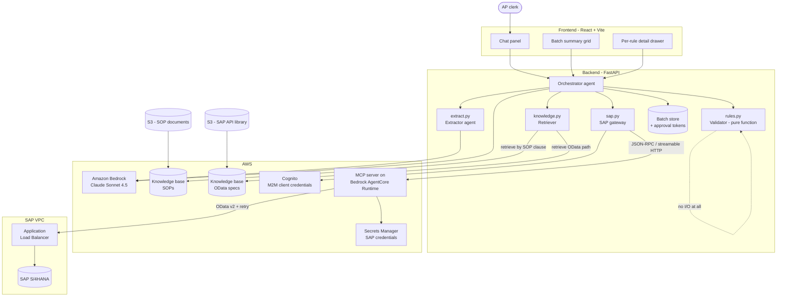
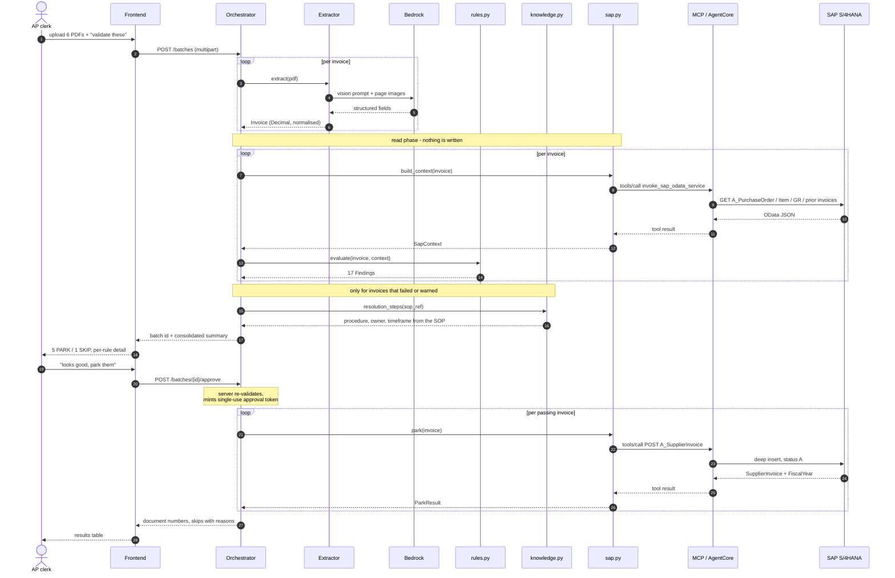

# Architecture

Autonomous SAP Accounts Payable: a business user uploads a batch of supplier
invoices, chats, approves once, and every valid invoice is parked in SAP
S/4HANA. Failures are skipped and explained in plain business language.

## Guiding principle

**The model reads. Code judges. A human approves.**

Language models are excellent at pulling fields off a scanned invoice and at
explaining a situation in business English. They are unreliable at arithmetic,
at applying a tolerance table consistently, and at never hallucinating a
purchase order. So extraction and explanation are the model's job, and every
accept/reject decision is a deterministic pure function that can be unit
tested, replayed, and audited.

That split is the core design decision. It is what makes the same batch produce
the same verdict twice, and what lets a judge ask "what if the threshold were
2% instead of 5%?" and get an answer by editing one table entry.

## Component map



The dashed self-loop on the validator is deliberate: it has no network, no
clock, no globals. Everything it needs arrives as an argument.

## Agents and responsibilities

| Component | Kind | Model | Responsibility |
|---|---|---|---|
| Orchestrator | LLM agent | Claude Sonnet 4.5 | The chat surface. Chooses tools, sequences the workflow, answers follow-up questions, asks for approval. Never decides pass/fail itself. |
| Extractor | LLM agent | Claude Sonnet 4.5 (vision) | One invoice document to one structured `Invoice`. Normalises German decimal commas, dates, units. Returns per-field confidence. |
| Validator | Deterministic | none | 17 rules against `SapContext`. Returns `Finding` objects with SOP references and approval routing. |
| Retriever | Retrieval | embeddings | Pulls the resolution procedure for a SOP clause the validator already named, and finds OData paths for questions outside the fixed rule set. Never produces a verdict. |
| SAP gateway | Deterministic | none | Every SAP read and the single write, routed through MCP. |
| Poster | Deterministic | none | Parks each passing invoice after approval; records document numbers. |

The multi-agent split is real but deliberately asymmetric. Making the validator
an agent would be worse, not better: it would be slower, non-reproducible, and
impossible to unit test.

## End-to-end call sequence



## How a SAP call is actually made

Every SAP call takes the same five hops. There is no direct OData path from the
backend; the MCP server is the only thing holding SAP credentials.

1. **Token.** `sap.py` posts client credentials to the Cognito token endpoint
   and caches the bearer for the process lifetime.
2. **Session.** A session id of at least 33 characters goes in the
   `X-Amzn-Bedrock-AgentCore-Runtime-Session-Id` header. `initialize` is sent
   once per client, then reused.
3. **JSON-RPC.** A `tools/call` request naming `invoke_sap_odata_service`, with
   the full OData URL, HTTP method and optional body as arguments.
4. **MCP server.** Running on AgentCore Runtime, it fetches the SAP credentials
   from Secrets Manager, obtains a CSRF token, and issues the OData request —
   retrying on transient failures. SAP sits in its own VPC behind an
   Application Load Balancer, so the call leaves AWS and comes back in.
5. **Response.** streamable-HTTP replies as server-sent events; the payload is
   the `data:` line. A 204 answers with an empty body, which the tool reports
   as prose rather than JSON.

```
sap.py  --Cognito M2M-->  AgentCore  --Secrets Manager-->  SAP OData
        <---- SSE JSON-RPC ---------  <---- CSRF + Basic ----
```

### Reads that build a SapContext

| # | Entity | Purpose | Rules served |
|---|---|---|---|
| 1 | `A_PurchaseOrder('{po}')` | header: vendor, company code, currency, deletion flag | R01, R02, R04, R05, R06 |
| 2 | `A_PurchaseOrderItem(...)` | material, quantity, price, GR-based flag | R03, R07, R09 |
| 3 | `A_SuplrInvcItemPurOrdRef?$filter=PurchaseOrder` | what already references this line | R08 |
| 4 | `A_SupplierInvoice?$filter=(keys)` | status join: exclude parked drafts | R08 |
| 5 | `A_MaterialDocumentItem?$filter=PurchaseOrder` | goods receipts, movement 101/102 | R12, R13 |
| 6 | `A_SupplierInvoice?$filter=InvoicingParty` | references already used for this vendor | R16 |

Rules R10, R11, R14, R15 and R17 need no SAP read at all. They still run when
SAP is unreachable, and they still run for an invoice whose purchase order does
not exist.

### Call budget

Measured on the six-invoice demo batch against the live system: **32 SAP calls,
76 seconds**.

Each `build_context` costs 4 to 6 calls, and a single MCP round trip takes
several seconds - AgentCore cold paths plus SAP itself. Call count is therefore
not the lever; concurrency is.

- **Concurrent reads.** Each invoice's reads are independent of every other
  invoice's, so they run in a thread pool with one client each. Wall time tracks
  the slowest single invoice rather than the sum: **202 seconds became 76**.
- **Read caches** on the client, keyed by `(po, item)` and by `InvoicingParty`.
  These matter when a batch holds several invoices against the same purchase
  order. On the demo batch every invoice targets a different PO, so only the
  vendor cache hits, saving 4 calls of 32. Worth having, not worth quoting as
  the reason the batch is fast.

The write phase is exactly one POST per passing invoice. No batching, because a
partial failure must be attributable to one invoice.

## The approval gate

The gate is enforced by the server, not by a system prompt. A prompt instruction
is a suggestion; this is a state machine.

```
CREATED -> EXTRACTED -> VALIDATED -> APPROVED -> PARKED
                            |
                            +-> a batch that was never VALIDATED cannot be APPROVED
```

- `POST /batches/{id}/approve` is the only path that mints an approval token.
- The token is single-use, bound to one batch id and to the exact set of
  invoice references that passed validation.
- `park()` is unreachable without it. If the batch content changed after
  validation, the token no longer matches and the write is refused.
- One approval covers the whole batch, which is what the challenge asks for.
- Nothing is ever posted for payment: `SupplierInvoiceStatus` is always `A`.

## Failure handling

A failure on one invoice never stops the batch. That is a requirement, not a
nicety.

| Situation | Behaviour |
|---|---|
| Purchase order does not exist | R01 fails; the ten PO-dependent rules report NOT_APPLICABLE, not FAIL. Dependent reads are skipped. |
| A rule fails | The invoice is skipped with its reason. Other invoices proceed. |
| A rule warns | The invoice still parks, but the required approval level rises to Manager or Controller per the SOP table. |
| SAP read errors | Raised, not swallowed. A "not found" is a verdict; a backend outage is a fault. |
| Park fails mid-batch | Recorded per invoice. Already-parked documents stay; they are drafts and are individually deletable. |

## Knowledge grounding

Two Bedrock Knowledge Bases sit behind the orchestrator, each fed from an S3
bucket. Both are already deployed.

| Knowledge base | Id | Contents |
|---|---|---|
| SOPs | `HRQMR9REUCexcd` | `AP-SOP-001` three-way match exception handling, duplicate invoice SOP |
| SAP API library | `M6GBMOSKQX` | OpenAPI specifications for the OData services |

### The boundary that matters

**Retrieval never produces a verdict.** A vector search that decides whether an
invoice is payable is a vector search that will eventually decide wrongly and
quietly. The division of labour is fixed:

| Question | Answered by |
|---|---|
| Does this invoice pass? | `rules.py` — deterministic |
| Why, in business terms? | `rules.py`, `Finding.message` |
| Which SOP clause governs it? | `rules.py`, `Finding.sop_ref` |
| What should the clerk do about it? | SOP knowledge base |
| Which OData path answers an ad-hoc question? | API knowledge base |

The SOP retrieval is keyed by the clause the validator has *already* named. It
is a lookup, not a search for the answer, so retrieval cannot drift the outcome
— at worst it returns unhelpful guidance next to a verdict that is still
correct.

### What this adds

`rules.py` produces the finding:

> Unit price EUR 11.71 is 3.17% above the agreed Purchase Order price of
> EUR 11.35 — a difference of EUR 3.60 on this line. `AP-SOP-001 6.1 / 8.1`

The SOP knowledge base then supplies what happens next, grounded in the actual
document rather than invented: check whether a PO amendment covers the
difference, contact Procurement to verify the increase on days 1–2, escalate to
the AP Manager if unresolved after five business days.

Verdict from code, remediation from the SOP. That is the "auto-suggest a
correction" stretch goal without a model guessing at company policy.

The API knowledge base covers the other direction. The six fixed reads serve
the 17 rules; when a user asks something outside them — "has this vendor been
short-delivered before?" — the orchestrator needs to discover an OData path it
was never hardcoded with.

### `knowledge.py`

```
resolution_steps(sop_ref, exception_type) -> list[Step]   # SOP KB
find_odata_path(question)                 -> str          # API KB
```

Both call `bedrock-agent-runtime.retrieve`. Retrieval runs only for invoices
that failed or warned, so a clean batch costs zero retrieval calls.

## Determinism and the tolerance table

Routing thresholds come from `AP-SOP-001` section 8.1 and live in a dictionary
in `rules.py`. A price variance of 0.35% auto-approves; 3.17% routes to an AP
Manager; both come from the same rule, and the difference is data, not a branch.

Each `Finding` carries the invoice value, the SAP value, the delta, the SOP
clause, and a business-English message, so the batch summary explains itself
without a second model call.

## Security

- SAP credentials never leave AWS. The backend has no SAP password; the MCP
  server reads them from Secrets Manager.
- Cognito machine-to-machine client credentials authenticate the MCP endpoint.
- No secret is logged. Request and response headers are logged by key name
  only, because a `Basic` header is reversible base64.
- All configuration is environment-driven; `.env` is gitignored and
  `.env.example` documents every variable.
- Writes are reversible by construction. A parked invoice creates no accounting
  entry and does not consume the purchase order.
- Every posting is tagged `<account-id>-<n>`, unique per team and per invoice,
  so nothing collides on a shared system.

## Build status

| Component | State |
|---|---|
| `src/backend/mcp/sap_mcp_server.py` | Deployed on AgentCore, verified live |
| `src/backend/rules.py` | Complete, 17 rules, 22 tests |
| `src/backend/sap.py` | Complete, 23 tests, park and delete verified against SAP |
| `src/backend/extract.py` | Complete - Bedrock vision, with a recorded fallback |
| `src/backend/knowledge.py` | Complete - Bedrock KB, falling back to the SOP markdown |
| `src/backend/agent.py` | Complete - Strands when Bedrock is reachable, grounded responder otherwise |
| `src/backend/api.py` | Complete - batch, approve, park, guidance, chat, reports |
| `src/frontend` | Complete - approvals, exceptions and reports |

## Verified against the live system

These were confirmed by calling SAP, not read off a specification:

- An invoice references `InvoicingParty` (`17401710`), not `Supplier`
  (`BP1710`).
- `NetPriceAmount` is the price for `NetPriceQuantity` units, not for one.
- A POST carrying `$format` is rejected as a disallowed system query option.
- A successful DELETE answers 204 with an empty body.
- Parked invoices do not consume a purchase order, so they must be excluded
  when computing how much of a line is already invoiced.
